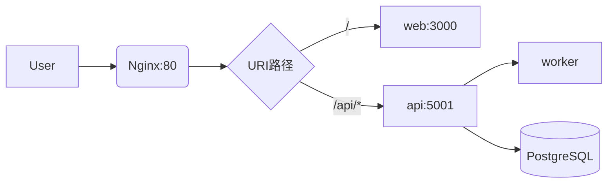

DeploymentArchitectureReporterAgent: Task received, starting analysis of project at /data/dify/.

# Dify 项目部署架构分析报告

## 0. 当前工作目录与初始确认
- **当前工作目录(CWD)**: `/app`
- **项目路径**: `/data/dify`
- **图像分析**: 未提供架构图像

## I. 项目概述与关键文件
### 项目基本信息
- 项目名称: Dify (开源LLM应用开发平台)
- 技术栈: 
  - 前端: Node.js/React
  - 后端: Python/FastAPI
  - 异步任务: Celery

### 关键配置文件
1. **部署配置**:
   - `docker-compose.yml` (核心部署蓝图)
   - `Dockerfile` (API服务容器配置)
2. **网络配置**:
   - `nginx/nginx.conf` (反向代理配置)
3. **环境配置**:
   - `.env` (环境变量)

### 源代码结构
```
├── api/             # Python后端服务
├── web/             # React前端应用
├── workers/         # Celery异步任务
├── docker-compose.yml
└── nginx/
```

## II. 容器化分析
### Dockerfile (API服务)
- **基础镜像**: `python:3.11-slim-bookworm`
- **暴露端口**: `5001`
- **启动命令**: `uvicorn main:app --host 0.0.0.0 --port 5001`

### Docker Compose 服务架构
| 服务名  | 镜像                     | 端口映射        | 关键配置                 |
|---------|--------------------------|-----------------|--------------------------|
| api     | langgenius/dify-api:latest | 5001:5001      | 核心API服务              |
| web     | langgenius/dify-web:latest | 3000:3000      | React前端                |
| worker  | langgenius/dify-api:latest | 无公共端口     | Celery异步任务           |
| nginx   | nginx:latest             | 80:80, 443:443 | 反向代理                 |

**网络拓扑**: 所有服务共享默认bridge网络，通过Docker DNS通信

## III. 反向代理配置分析
### Nginx路由规则 (`nginx/nginx.conf`)
```nginx
server {
  listen 80;
  
  location / {
    proxy_pass http://web:3000; # 前端路由
  }
  
  location /api {
    proxy_pass http://api:5001; # API路由
  }
}
```

**流量路径**:
1. 所有HTTP(80)请求进入Nginx
2. 路径`/` → 转发至web服务(3000端口)
3. 路径`/api/*` → 转发至api服务(5001端口)

## IV. 网络暴露与内部拓扑
### 公共暴露点
| 入口组件 | 暴露接口 | 目标服务 | 内部端口 |
|----------|----------|----------|----------|
| Nginx    | :80      | web      | 3000     |
| Nginx    | :80      | api      | 5001     |

### 内部服务通信


**关键连接**:
- **数据库连接**: `postgresql://{user}:{pass}@db:{port}/{name}` (通过Docker DNS访问)
- **服务发现**: 使用Docker内置DNS (如`web`, `api`, `db`主机名)

### 网络暴露准则遵守
- 仅Nginx直接暴露于公网
- 所有应用服务(api/web/worker)仅通过内部网络通信
- 数据库无公共端口映射

## V. 代码架构分析
### 模块划分
| 路径       | 类型       | 功能描述                     |
|------------|------------|------------------------------|
| web/       | 前端       | React用户界面                |
| api/       | 后端       | FastAPI核心逻辑              |
|  ├── controllers/ | API端点    | 请求处理入口                 |
|  ├── services/    | 业务逻辑   | 核心业务实现                 |
|  └── models/      | 数据模型   | 数据库ORM映射                |
| workers/   | 异步任务   | Celery后台任务               |

### 核心框架
| 组件   | 框架                | 版本       | 用途                     |
|--------|---------------------|------------|--------------------------|
| 前端   | React              | ^18.2.0    | UI组件构建               |
| 后端   | FastAPI            | 0.104.1    | REST API框架             |
| 异步   | Celery             | 5.3.4      | 分布式任务队列           |
| ORM    | SQLAlchemy         | 2.0.23     | 数据库操作               |

### 高层架构模式
1. **分层架构**:
   - 表示层: React前端
   - 网关层: Nginx
   - 应用层: FastAPI + Celery
   - 数据层: PostgreSQL

2. **请求流程**:
   ```
   用户请求 → Nginx路由 → React页面渲染 或 FastAPI端点
           → FastAPI控制器 → 服务层业务逻辑
           → 模型层数据库操作
           → 耗时操作分发至Celery Worker
   ```

### 构建管理
- 前端: `npm` (web/package.json)
- 后端: `pip` (api/requirements.txt)

## VI. 工具使用记录
1. `pwd` → 确认工作目录
2. `README.md分析` → 项目基础信息
3. `docker-compose.yml解析` → 服务架构
4. `nginx.conf解析` → 路由规则
5. `环境变量验证` → 数据库连接
6. `package.json/requirements.txt` → 框架版本

---
**报告生成时间**: 2025-04-08